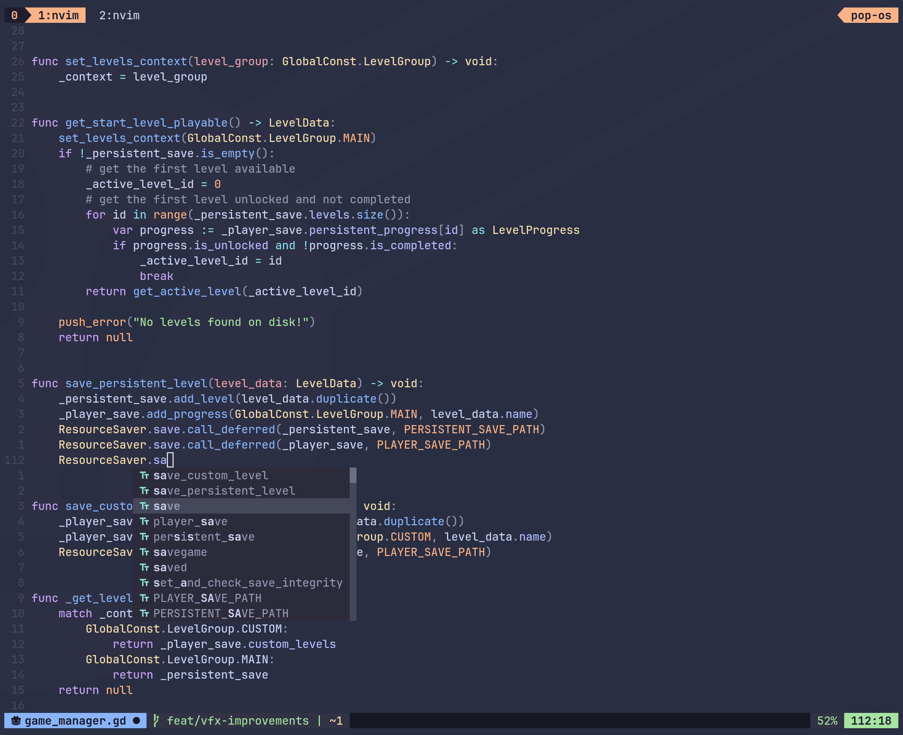
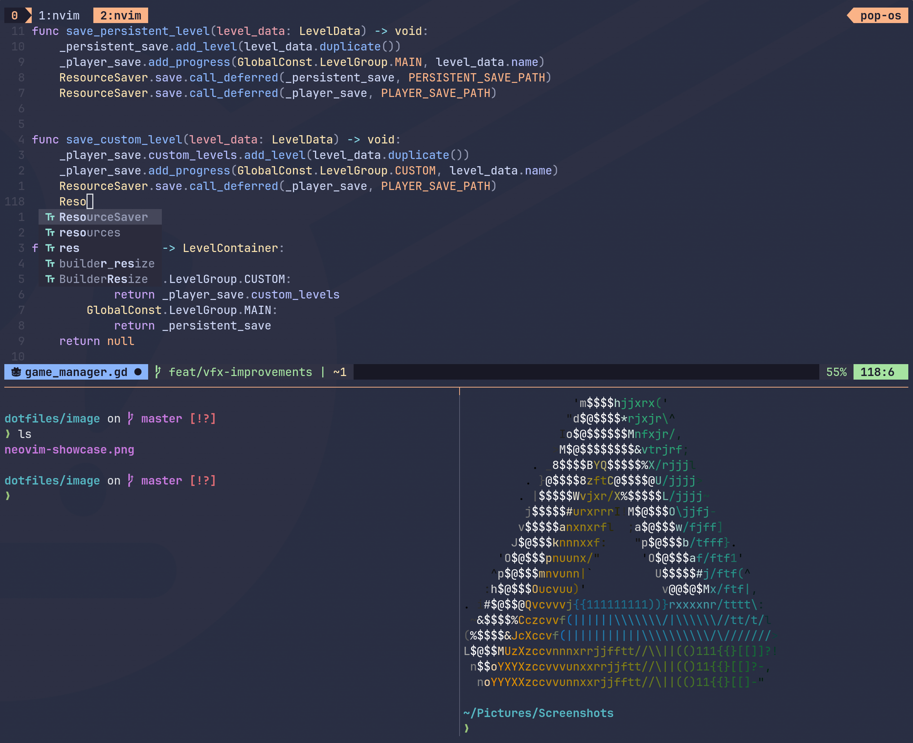

# Personal configuration files

## Neovim
Complete Neovim configuration.

## Tmux
Basic style of tmux, a terminal multiplexer.

## Sway
Tile manager GUI

## Waybar
Status bar for Sway

## Alacritty
Terminal emulator
