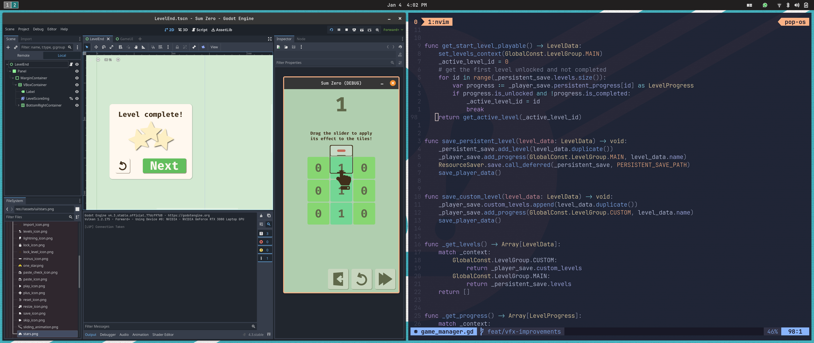

# Personal configuration files

## OS
I prefer to work on Linux machine (tile manager is mandatory) mainly from terminal. I'm using [Pop_os!](https://pop.system76.com/) on my personal machine and Fedora on my working machine. Not a big fun of Pop_os!, but gets things done.

## Neovim
I use [Neovim](https://github.com/neovim/neovim) for the vast majority of my programming experience.

### Basic configuration
I use common LSP and [tree-sitter](https://github.com/tree-sitter/tree-sitter) plugins as well as the famous [telescope](https://github.com/nvim-telescope/telescope.nvim). I use [conform](https://github.com/stevearc/conform.nvim) to format every file whenever saved. I love to use [blink](https://github.com/Saghen/blink.cmp) to handle completion and [trouble](https://github.com/folke/trouble.nvim) to handle errors. Furthermore, I use a few other plugins depending on what I'm working on. Some examples are: [dadbod](https://github.com/tpope/vim-dadbod) or spectral-language-server LSP.

I'm a [catpuccin](https://github.com/catppuccin/nvim) guy, but I love to add an orange twist in it. I use [neotab](https://github.com/kawre/neotab.nvim) to handle tabs and [oil](https://github.com/stevearc/oil.nvim) to manage files. I use [lualine](https://github.com/nvim-lualine/lualine.nvim) as status line.

I use some QOL plugin such as [noice](https://github.com/folke/noice.nvim) and [snacks](https://github.com/folke/snacks.nvim/) and I try to keep my experience as minimal as possible.

### Java experience
I use [jdtls](https://github.com/mfussenegger/nvim-jdtls) as LSP with multiple runtime configured. I don't use any debugging or test plugin, instead, I prefer to execute my tests from terminal itself using `maven`.

### Godot experience
I use gdtoolkit as LSP and the fantastic [gdformat](https://github.com/Scony/godot-gdscript-toolkit) as formatter.

## Tmux
Mainly using tmux as a terminal multiplexer.

## Sway
Tile manager GUI.

## Waybar
Status bar for Sway.

## Alacritty or Kitty
I'm trying Kitty, but I really don't mind Alacritty too. I don't have a clear preference yet.
